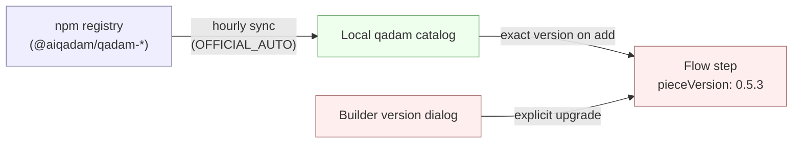

Qadams are standard [npm packages](https://www.npmjs.com/search?q=%40activepieces%2Fpiece-). Two facts follow from that:

- **No server upgrade is needed for new qadams** — a sync job pulls fresh versions on its own.
- **Each step is pinned to an exact version** — flows never auto-upgrade. Bumps are explicit, through the builder.

## Packaging

| Type | Source | Installed by |
|---|---|---|
| Official | Qadam Flow cloud registry | Auto-sync |
| Custom (npm) | npm registry, scoped to one platform | Platform admin |
| Private (archive) | `.tgz` upload | Platform admin |

Custom and private qadams are managed manually — see [Manage qadams](/admin-guide/guides/manage-qadams).

## Auto-sync

| `AP_QADAMS_SYNC_MODE` | Behavior |
|---|---|
| `OFFICIAL_AUTO` | Hourly reconcile against the cloud registry. Default for all deployments. |

Custom and private qadams are never touched by the sync job.

## Server compatibility

Every qadam declares a `minimumSupportedRelease` (and optional `maximumSupportedRelease`) in its definition — the range of Qadam Flow server releases it works on. The catalog filters qadams against the running server's release, so an out-of-range qadam is never listed in the builder and never served from the registry.

<Warning>
**Self-hosted: upgrade to `0.82.0` or newer.** Every new qadam now declares `minimumSupportedRelease ≥ 0.82.0`, the floor that came in with the latest qadam-context version. Servers below `0.82.0` will not pick up any newly published qadams or bug fixes. Cloud is always on the latest release.
</Warning>

## Version pinning

Adding a step records the exact qadam version at that moment (e.g. `0.5.3`). The pin stays until a human changes it. To upgrade, open the step in the builder, click the version next to its name, and pick a new one. The dialog warns when the change crosses a minor or major boundary.

## Related

- [Manage qadams](/admin-guide/guides/manage-qadams) — install, hide, upload custom qadams.
- [Qadam versioning](/build-qadams/qadam-reference/qadam-versioning) — semver rules for qadam authors.
