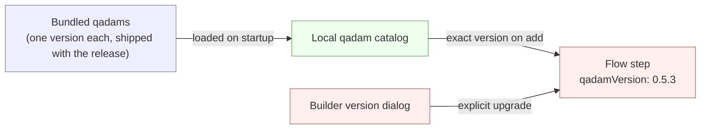

Qadams are npm packages, and each flow step is pinned to an exact qadam version. Two facts shape how that works on your server today:

- **Official qadams run from the image.** Each release bundles one version of every official qadam (`loadBundledQadams`). The same qadams are also published to npm under the `@aiqadam` scope, but the server does not install official qadams from there, so picking up new official versions means upgrading the server.
- **A pin moves only inside its compatible range on its own.** When the exact version a step names is not available, the server may run another version only if semver calls it compatible. Anything else is an explicit upgrade in the builder.

```mermaid
flowchart LR
    BUNDLE["Bundled qadams<br/>(one version each, shipped with the release)"]
    CAT["Local qadam catalog"]
    STEP["Flow step<br/>qadamVersion: 0.5.3"]
    UI["Builder version dialog"]

    BUNDLE -- "loaded on startup" --> CAT
    CAT -- "exact version on add" --> STEP
    UI -- "explicit upgrade" --> STEP

    classDef src fill:#eef,stroke:#88a
    classDef catalog fill:#efe,stroke:#7a7
    classDef flow fill:#fee,stroke:#a77
    class BUNDLE src
    class CAT catalog
    class STEP,UI flow
```

## Packaging

| Type | Source | Installed by |
|---|---|---|
| Official | Bundled with the Qadam Flow release | Loaded automatically on startup |
| Custom (npm) | npm registry, scoped to one platform | Platform admin |
| Private (archive) | `.tgz` upload | Platform admin |

Custom and private qadams keep every version an admin installs, side by side. Official qadams keep only the version bundled with the running release. Custom and private qadams are managed manually — see [Manage qadams](/admin-guide/guides/manage-qadams).

## Version pinning

Adding a step records the exact qadam version at that moment (for example `0.5.3`). To upgrade, open the step in the builder, click the version next to its name, and pick a new one. The dialog warns when the change crosses a minor or major boundary, because that is where a qadam author signals a breaking change — see [Qadam versioning](/build-qadams/qadam-reference/qadam-versioning).

## When a pinned version is not available

A server upgrade can replace the bundled version of an official qadam, so a step may name a version the server no longer has. The server then resolves the step as follows:

1. **Inside the caret range** — the bundled version runs in its place when it is compatible with the pin: the same minor version for a `0.x` qadam (`^0.5.3` accepts `0.5.9`, not `0.6.0`), the same major version from `1.0.0` on. The server logs a warning naming both versions.
2. **Outside it** — the step does not run. The builder shows "Qadam version unavailable" on the step, `ap_validate_flow` and `ap_flow_structure` report the pin, and the step needs an explicit upgrade. A published flow is not disabled because of it.

<Note>
One exception. When a flow version is first migrated to flow schema version 32, a one-off migration repoints each pin that cannot be resolved at that moment to a version the server can serve, even across a breaking boundary, after storing a backup of the flow version. It runs once per flow version, not on every upgrade, so it does not repair a pin that becomes unavailable later.
</Note>

The plan for removing this limitation — a versioned store on a persistent volume, so that a step runs the exact version it names — is [ADR-0003](https://github.com/aiqadam/qadam-flow/blob/main/adr/0003-official-qadams-run-from-a-versioned-local-store.md). The volume is already part of the install, see [Qadam version store](/install/architecture/qadam-version-store). Workers in the `UNSANDBOXED` and `SANDBOX_CODE_ONLY` execution modes already run an official qadam version from it when it holds that version, but no image puts versions in it yet, so on a real install the behavior above is still what your server does.

## Server compatibility

Every qadam can declare a `minimumSupportedRelease` and a `maximumSupportedRelease`: the range of Qadam Flow server releases it works on. The catalog filters qadams against the running server's release, so an out-of-range qadam is never listed in the builder and never served.

Official qadams effectively declare `0.82.0` as their floor, which every Qadam Flow release from `1.0.0` on meets, so on a supported release the floor never hides an official qadam. What the floors mean and how authors set them is in [Qadam versioning](/build-qadams/qadam-reference/qadam-versioning#compatibility-floors).

## Related

- [Manage qadams](/admin-guide/guides/manage-qadams) — install, hide, upload custom qadams.
- [Qadam versioning](/build-qadams/qadam-reference/qadam-versioning) — what a qadam version promises, for qadam authors.
