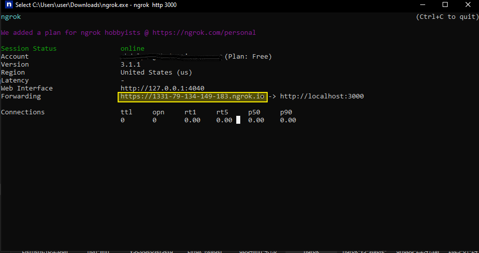

<Warning>
This setup is only meant for personal use or testing. It runs on [PGLite](https://pglite.dev/) (embedded PostgreSQL) and an in-memory Redis queue, which supports only a single instance on a single machine. For production or multi-instance setups, you must use Docker Compose with PostgreSQL and Redis. You will not be able to upgrade from Community Edition to Enterprise out of the box, as Enterprise does not support PGLite.
</Warning>

To get up and running quickly with Qadam Flow, we will use the Qadam Flow Docker image. Follow these steps:

## Prerequisites

You need to have [Git](https://git-scm.com/book/en/v2/Getting-Started-Installing-Git) and [Docker](https://docs.docker.com/get-docker/) installed on your machine in order to set up Qadam Flow via Docker Compose.

## Install

### Pull Image and Run Docker image 

Pull the Qadam Flow Docker image and run the container with the following command:

```bash
docker run -d -p 8080:80 -v ~/.activepieces:/root/.activepieces -e AP_REDIS_TYPE=MEMORY -e AP_DB_TYPE=PGLITE -e AP_FRONTEND_URL="http://localhost:8080" activepieces/activepieces:latest
```

### Configure Webhook URL (Important for Triggers, Optional If you have public IP)

**Note:** By default, Qadam Flow will try to use your public IP for webhooks. If you are self-hosting on a personal machine, you must configure the frontend URL so that the webhook is accessible from the internet.

**Optional:** The easiest way to expose your webhook URL on localhost is by using a service like ngrok. However, it is not suitable for production use.

1. Install ngrok
2. Run the following command:
```bash
ngrok http 8080
```
3. Replace `AP_FRONTEND_URL` environment variable in the command line above.




## Upgrade 

Please follow the steps below:

### Step 1: Back Up Your Data (Recommended)

Before proceeding with the upgrade, it is always a good practice to back up your Qadam Flow data to avoid any potential data loss during the update process.

1. **Stop the Current Qadam Flow Container:** If your Qadam Flow container is running, stop it using the following command:
   ```bash
   docker stop activepieces_container_name
   ```

2. **Backup Qadam Flow Data Directory:** By default, Qadam Flow data is stored in the `~/.activepieces` directory on your host machine. Create a backup of this directory to a safe location using the following command:
   ```bash
   cp -r ~/.activepieces ~/.activepieces_backup
   ```

### Step 2: Update the Docker Image

1. **Pull the Latest Qadam Flow Docker Image:** Run the following command to pull the latest Qadam Flow Docker image from Docker Hub:
   ```bash
   docker pull activepieces/activepieces:latest
   ```

### Step 3: Remove the Existing Qadam Flow Container

1. **Stop and Remove the Current Qadam Flow Container:** If your Qadam Flow container is running, stop and remove it using the following commands:
   ```bash
   docker stop activepieces_container_name
   docker rm activepieces_container_name
   ```

### Step 4: Run the Updated Qadam Flow Container

Now, run the updated Qadam Flow container with the latest image using the same command you used during the initial setup. Be sure to replace `activepieces_container_name` with the desired name for your new container.

```bash
docker run -d -p 8080:80 -v ~/.activepieces:/root/.activepieces -e AP_REDIS_TYPE=MEMORY -e AP_DB_TYPE=PGLITE -e AP_FRONTEND_URL="http://localhost:8080" --name activepieces_container_name activepieces/activepieces:latest
```


Congratulations! You have successfully upgraded your Qadam Flow Docker deployment
