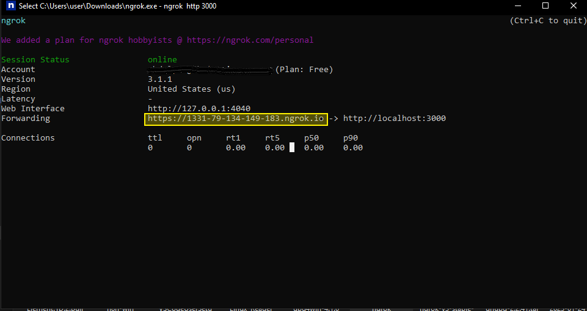

There are two ways to get Qadam Flow running with Docker:

1. **The one-line installer (recommended).** It sets up the full stack — app, workers, PostgreSQL and Redis — with generated secrets.
2. **A single container.** Good for a quick look or a throwaway test, backed by an embedded database and an in-memory queue.

## Quick install (recommended)

Paste this into any macOS, Linux, or WSL2 shell:

```bash
curl -fsSL https://flow.aiqadam.org/run.sh | sh
```

When it finishes, open [http://localhost:8080/sign-up](http://localhost:8080/sign-up). The first account to sign up owns the platform.

### What the installer does

<Steps>
  <Step title="Checks your machine">
    Requires `curl`, `openssl`, `docker`, and Docker Compose v2 (`docker compose`), and verifies the Docker daemon is reachable. Native Windows shells are refused — run it from WSL2.
  </Step>
  <Step title="Creates an install directory">
    Everything lands in `./qadam-flow` in your current directory. Re-running the installer in the same place refreshes the compose file and keeps your existing `.env`.
  </Step>
  <Step title="Downloads docker-compose.yml">
    Fetched from `https://raw.githubusercontent.com/aiqadam/qadam-flow/main/docker-compose.yml`. No git clone and no source build.
  </Step>
  <Step title="Generates a .env with fresh secrets">
    `AP_ENCRYPTION_KEY`, `AP_JWT_SECRET` and the PostgreSQL password are generated with `openssl rand`. Delete `.env` and re-run to rotate them.
  </Step>
  <Step title="Pulls the image and starts the stack">
    Runs `docker compose pull` followed by `docker compose up -d`, using `ghcr.io/aiqadam/qadam-flow:latest` (roughly 400 MB on first pull).
  </Step>
  <Step title="Waits for the API">
    Polls `http://localhost:8080/api/v1/flags` for up to 3 minutes, then prints the URL.
  </Step>
</Steps>

### Installer options

Set these before piping to `sh`, for example `QADAM_FLOW_DIR=/opt/qadam-flow`:

| Variable           | Default                             | Effect                                                             |
| ------------------ | ----------------------------------- | ------------------------------------------------------------------ |
| `QADAM_FLOW_DIR`   | `qadam-flow`                        | Install directory the compose file and `.env` are written to.       |
| `QADAM_FLOW_IMAGE` | `ghcr.io/aiqadam/qadam-flow:latest` | Image used by the app and worker services.                         |
| `QADAM_FLOW_REF`   | `main`                              | Git ref the `docker-compose.yml` is downloaded from.                |
| `QADAM_FLOW_PORT`  | `8080`                              | Port written into `AP_FRONTEND_URL` and used for the health check.  |

<Note>
`QADAM_FLOW_PORT` does **not** change the published port. `docker-compose.yml` maps `8080:80`, so to serve the app on a different host port you also have to edit that mapping in `qadam-flow/docker-compose.yml`.
</Note>

### Day-two commands

Run these from your install directory (`qadam-flow` by default):

```bash
docker compose logs -f app worker             # follow logs
docker compose down                           # stop, keep data
docker compose pull && docker compose up -d   # upgrade to the latest image
docker compose down -v                        # stop AND delete all data
```

For the details of the compose stack and every value in `.env`, see [Docker Compose](./docker-compose).

## Single container

<Warning>
This setup is meant for personal use and testing only. It runs on [PGLite](https://pglite.dev/) (embedded PostgreSQL) and an in-memory queue, which supports exactly one instance on one machine. For anything shared or long-lived, use [Docker Compose](./docker-compose) with PostgreSQL and Redis.
</Warning>

```bash
docker run -d --name qadam-flow \
  -p 8080:80 \
  -v ~/.qadam-flow:/root/.qadam-flow \
  -e AP_CONFIG_PATH=/root/.qadam-flow \
  -e AP_DB_TYPE=PGLITE \
  -e AP_REDIS_TYPE=MEMORY \
  -e AP_FRONTEND_URL=http://localhost:8080 \
  ghcr.io/aiqadam/qadam-flow:latest
```

What each flag is for:

| Setting                              | Why                                                                                                                                                          |
| ------------------------------------ | ------------------------------------------------------------------------------------------------------------------------------------------------------------ |
| `-p 8080:80`                         | The container listens on port `80`.                                                                                                                          |
| `-v ~/.qadam-flow:/root/.qadam-flow` | Persists the PGLite database and `settings.json`. Delete this directory and you lose everything, including the auto-generated secrets.                        |
| `AP_CONFIG_PATH`                     | Where the PGLite database and local settings are stored inside the container.                                                                                 |
| `AP_DB_TYPE=PGLITE`                  | Use the embedded database instead of an external PostgreSQL server.                                                                                           |
| `AP_REDIS_TYPE=MEMORY`               | Use the in-memory queue instead of Redis. In this mode `AP_ENCRYPTION_KEY` and `AP_JWT_SECRET` are generated on first boot and stored under `AP_CONFIG_PATH`.  |
| `AP_FRONTEND_URL`                    | The base URL used for webhook and redirect URLs. Must be a valid URL.                                                                                        |

Then open [http://localhost:8080/sign-up](http://localhost:8080/sign-up).

Every other setting is optional — see [Environment Variables](../configuration/environment-variables).

## Configure the webhook URL

By default Qadam Flow uses `AP_FRONTEND_URL` to build webhook URLs. If you are self-hosting on a personal machine, that URL has to be reachable from the internet for app triggers to work.

The quickest way to expose a local port is [ngrok](https://ngrok.com/). It is not suitable for production.

<Steps>
  <Step title="Install ngrok">
    Follow the [ngrok getting started guide](https://ngrok.com/docs/getting-started/).
  </Step>
  <Step title="Expose port 8080">
    ```bash
    ngrok http 8080
    ```
  </Step>
  <Step title="Point Qadam Flow at the tunnel">
    Set `AP_FRONTEND_URL` to the HTTPS URL ngrok prints, then restart the container — or, for the compose stack, update `.env` and run `docker compose up -d`.
  </Step>
</Steps>



## Upgrade

<Info>
Review the [breaking changes](../configuration/breaking-changes) before upgrading, and back up your data first.
</Info>

### One-line installer

From your install directory:

```bash
cd qadam-flow
docker compose pull
docker compose up -d --remove-orphans
```

Your `.env` and the PostgreSQL and Redis volumes are untouched.

### Single container

<Steps>
  <Step title="Back up the data directory">
    ```bash
    docker stop qadam-flow
    cp -r ~/.qadam-flow ~/.qadam-flow-backup
    ```
  </Step>
  <Step title="Pull the new image">
    ```bash
    docker pull ghcr.io/aiqadam/qadam-flow:latest
    ```
  </Step>
  <Step title="Replace the container">
    ```bash
    docker rm qadam-flow
    ```

    Then run the same `docker run` command as above. Because the data lives in `~/.qadam-flow`, your flows and connections survive.
  </Step>
</Steps>

## Uninstall

<Warning>
Both commands below delete your flows, runs, and connections. There is no undo.
</Warning>

For the compose stack:

```bash
cd qadam-flow
docker compose down -v
```

For the single container:

```bash
docker rm -f qadam-flow
rm -rf ~/.qadam-flow
```
